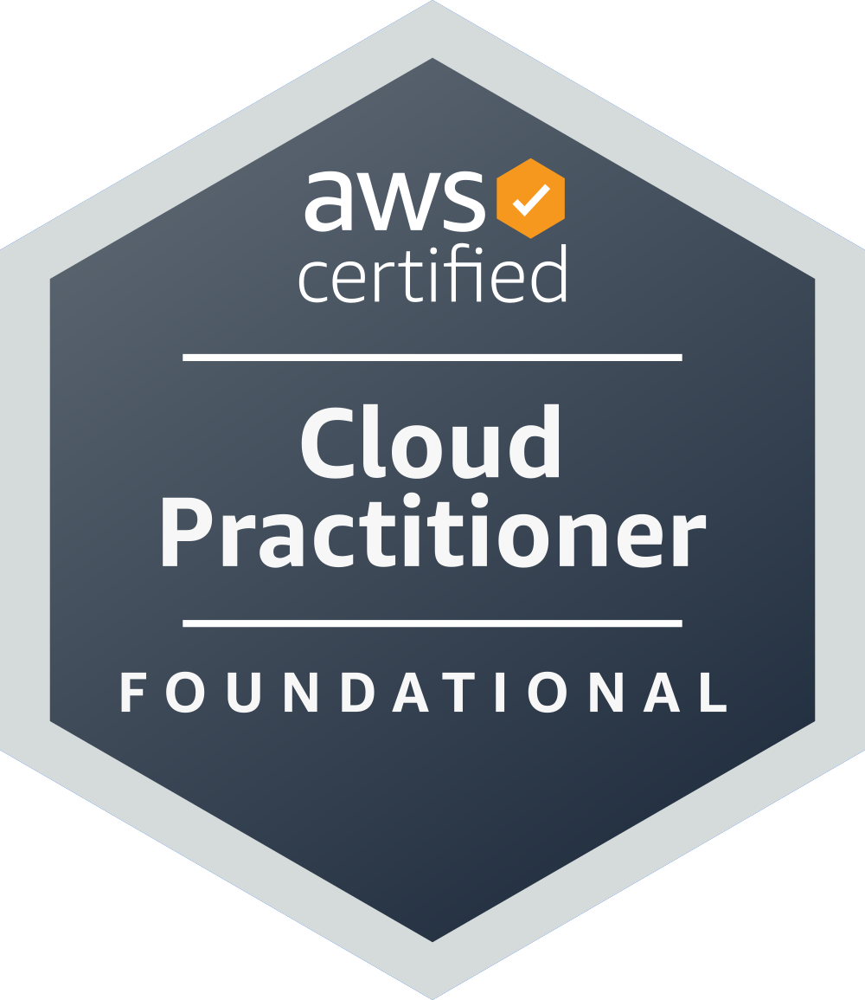
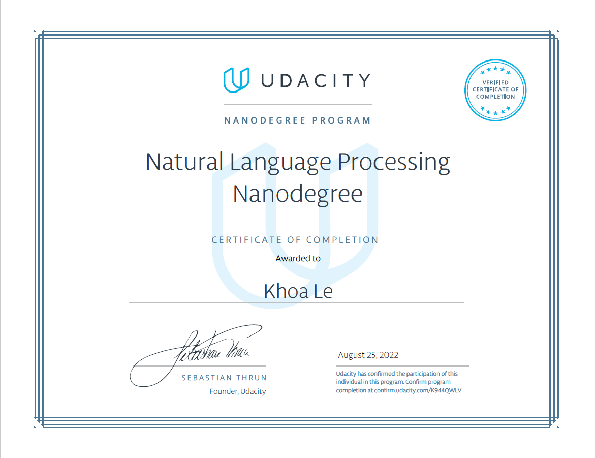
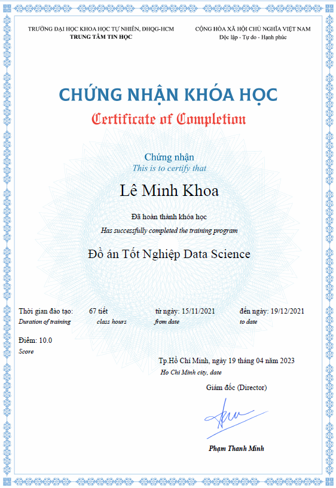

<h2>ABOUT ME</h2>


<div align="left">
  <a href="https://www.linkedin.com/in/khoalm/">
    
  </a>
  <a href="mailto:leminkhoa@gmail.com">
    
  </a>
  <a href="https://medium.com/@lminhkhoa">
    
  </a>
</div>


```yaml
name: Khoa Le Minh
located_in: Ho Chi Minh city, Vietnam
current_job: Senior Data Engineer
current company: Rackspace Technology
years_of_experience: 8


programming_languages: ["Python", "Go","Java"]

fields_of_interests:
  [
    "Data Engineering",
    "Master Data Management (MDM)",
    "Data Quality & Governance",
    "Cloud Data Platform Architecture",
    "Data Mesh Architecture",
    "Software Engineering Principles in Data",
    "DevOps"
  ]

technical_background:
  - role: "Senior Data Engineer"
    at: Rackspace Technology
    duration: "1 yr 10 mos"
  - role: "Senior Data Engineer / Senior Data Analyst"
    at: FPT SoftWare
    duration: "2 yrs 8 mos"
  - role: "Sales Efficiency Analyst"
    at: Home Credit
    duration: "1 yr 6 mos"

education:
  - "Bachelor's in Marketing - Ho Chi Minh International University",
  - "Self-Taught Data Engineer and Analytics",

currently_learning: ["Terraform", "Ansible", "Kafka", "Flink"], 
hobbies: ["Piano", "Video Games", "Travelling", "Homelab", "Chinese"]

```

<h2>CERTIFICATION</h2>

<h3>PROFESSIONAL CERTIFICATES</h3>
<a href="https://cp.certmetrics.com/amazon/en/public/verify/credential/ZX34JEWCWMREQHSX"></a>
<a href="https://credentials.databricks.com/f6cc5144-63f7-43bd-ba46-429cd0221d67#acc.8FOfzQ6E"></a>
<a href="https://credentials.databricks.com/8daa3a21-5f1b-4532-9777-ecf573a1fb44#gs.4pb1di"></a>

<h2>LANGUAGE PROFICIENCY</h2>

<p align="center">
    
  </a>
</p>

<p align="center">
  
  
</p>

<p align="center">
  
  
  
  
</p>


<h3>TRAINING COURSES</h3>
<div align="center">
  <table>
    <tr>
      <td align="center">
          
          <br><b>Cloud Developer</b>
        </a>
      </td>
      <td align="center">
        <a href="https://graduation.udacity.com/confirm/GQ5HKLDK">
          
          <br><b>Data Scientist</b>
        </a>
      </td>
      <td align="center">
        <a href="https://graduation.udacity.com/confirm/JUPJCZC7">
          
          <br><b>Data Engineering</b>
        </a>
      </td>
    </tr>
    <tr>
      <td align="center">
        <a href="https://graduation.udacity.com/confirm/R4VXDR3R">
          
          <br><b>Full Stack Web Developer</b>
        </a>
      </td>
      <td align="center">
        <a href="https://graduation.udacity.com/confirm/GEHFK3WD">
          
          <br><b>ML DevOps Engineer</b>
        </a>
      </td>
      <td align="center">
        <a href="https://graduation.udacity.com/confirm/K944QWLV">
          
          <br><b>Natural Language Processing</b>
        </a>
      </td>
    </tr>
    <tr>
      <td align="center">
        
        <br><b>Data Science Capstone Project</b>
      </td>
    </tr>
  </table>
</div>


<h2>TECH STACK</h2>

<h3>Programming Languages</h3>
<div align="left">
  
  
  
</div>

<h3>Cloud Platforms</h3>
<div align="left">
  
  
</div>

<h3>Data Platforms</h3>
<div align="left">
  
  
</div>

<h3>Business Intelligence</h3>
<div align="left">
  
  
</div>

<h3>DevOps & Infrastructure</h3>
<div align="left">
  
  
  
  
  
  
</div>

<h3>Databases</h3>
<div align="left">
  
  
  
</div>


<h2>PROFILE STATISTICS</h2>

<div align="center">
  
  
  

<div align="center">
  
</div>

</div>

<h2>RECENT ACHIEVEMENTS</h2>

- **Top Performer** at Rackspace Technology - Enhanced projects with innovation and efficiency improvements
- **Technical Leadership** - Lead & support team on code and design reviews, enforced coding standards
- **Data Quality Innovation** - Built data quality service with Great Expectations for better data control
- **Performance Optimization** - Improved legacy code performance through ThreadPool, materialized strategies, partitioning, and Spark SQL tuning
- **Engineering Excellence** - Applied software engineering principles to data engineering, including unit/integration testing, CI/CD and SOLID codebase. 

<h2>CONTACT</h2>

- 📧 **Email:** leminkhoa@gmail.com
- 📱 **Phone:** +84909141557
- 💼 **LinkedIn:** [linkedin.com/in/khoalm/](https://linkedin.com/in/khoalm/)
- ✍️ **Medium:** [medium.com/@lminhkhoa](https://medium.com/@lminhkhoa)
- 📍 **Location:** Ho Chi Minh City, Vietnam

---

<div align="center">
  
</div>